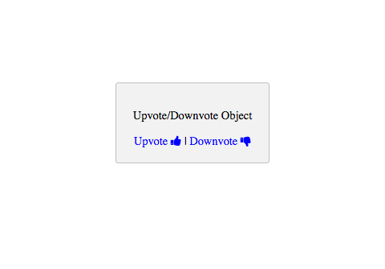

# starterTemplate-Vote-Object-API

**NOTE: Users must be logged in to use the voting function!**

**CLONING: When cloning this repo, you must initialize your app to make it work.**

 1) **Initialize the front-end of your app with Stamplay**
 <br>
- Go to your command line and enter **stamplay init**
- When prompted, enter your **appID** & **API Key**

2) **Establish object to be voted**
- Go to your Stamplay editor and go to the **Data** section. Then go to **Objects**
- Establish what object in the collection your going to upvote/downvote by getting it's **object Id**.

3) **Upvote Object**
```

function upvote(){
	var data = JSON.stringify({
  		"type": "upvote"
	});

	var xhr = new XMLHttpRequest();
	xhr.withCredentials = true;

	xhr.addEventListener("readystatechange", function () {
  		if (this.readyState === this.DONE) {
    		console.log(this.responseText);
  		}
	});

	xhr.open("PUT", "https://[yourAppId].stamplayapp.com/api/cobject/v1/:cobjectId/:id/vote");
	xhr.setRequestHeader("accept", "application/json");
	xhr.setRequestHeader("content-type", "application/json");
	xhr.send(data);
}
```
4) **Downvote Object**
```

function downvote(){
	var data = JSON.stringify({
  		"type": "downvote"
	});

	var xhr = new XMLHttpRequest();
	xhr.withCredentials = true;

	xhr.addEventListener("readystatechange", function () {
  		if (this.readyState === this.DONE) {
    		console.log(this.responseText);
  		}
	});

	xhr.open("PUT", "https://[yourAppId].stamplayapp.com/api/cobject/v1/:cobjectId/:id/vote");
	xhr.setRequestHeader("accept", "application/json");
	xhr.setRequestHeader("content-type", "application/json");
	xhr.send(data);
}
```

